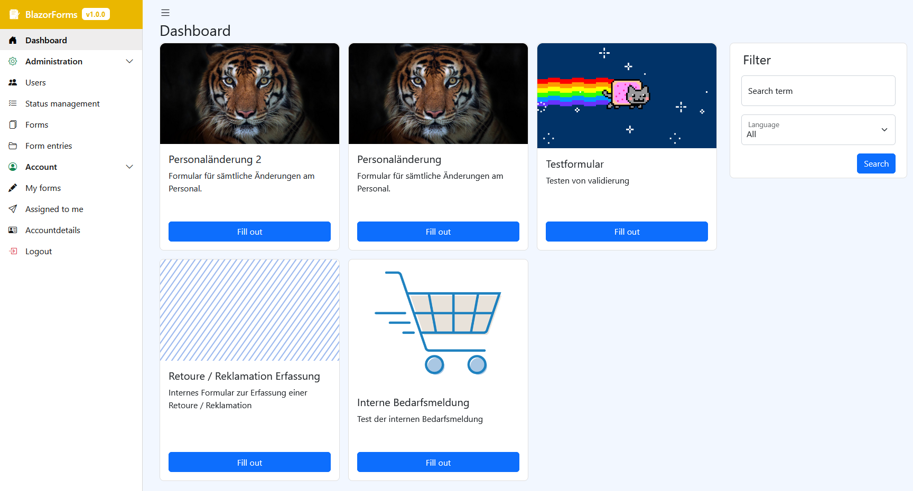
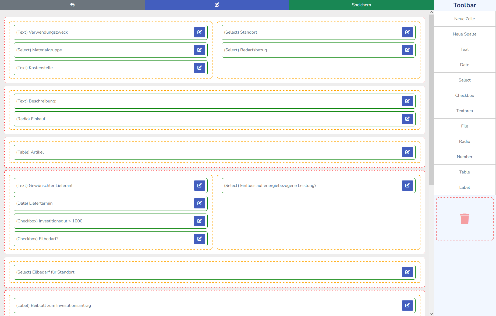
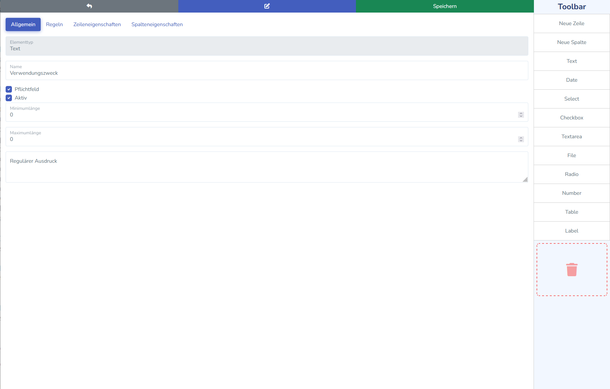
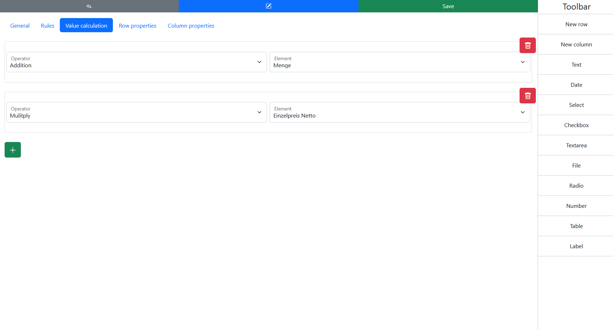
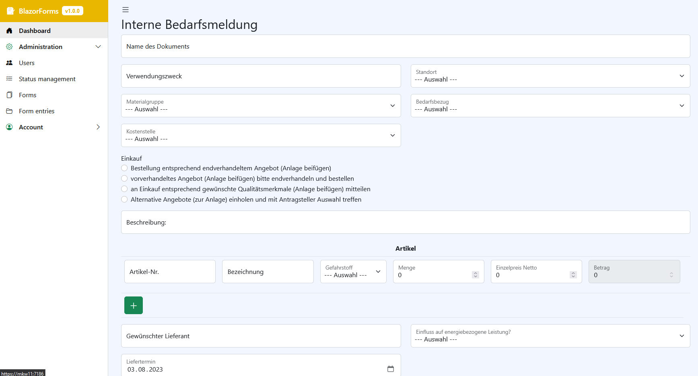
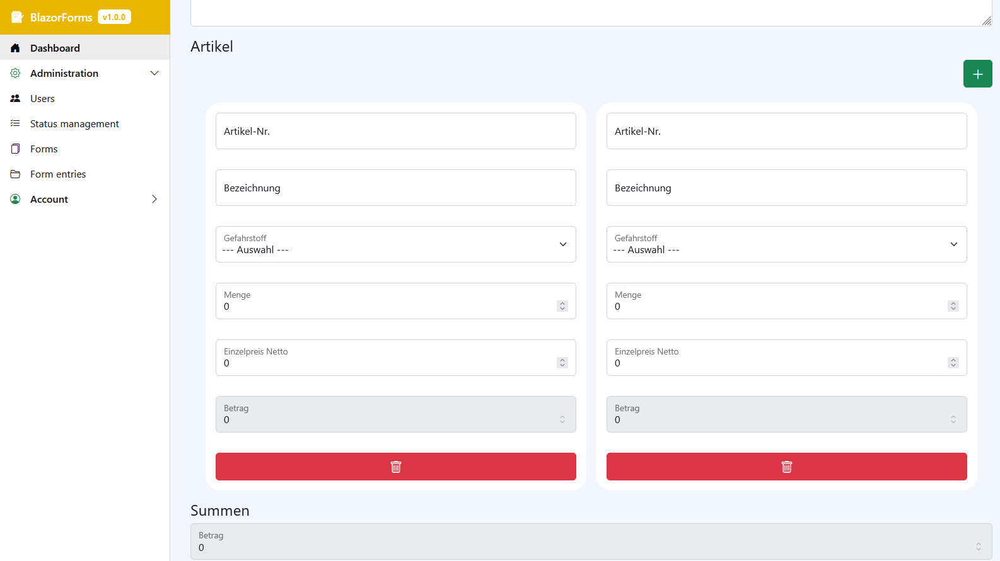
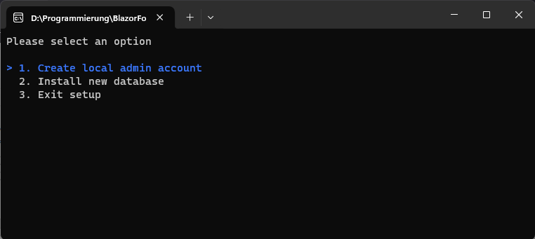

# BlazorForms
Create dynamic PDF forms completely in the web.








## Requirements
* MariaDB Database
* ASP.NET Core 8 Hosting Bundle x64

## Features
* Login via LDAP or local account
* Create unlimited amount of forms
* Submitted forms can be edited afterwards
* Supports both German & English
* Forms can be limited to fill out by certain users or logged in users
* Define managers for forms who can see all submitted entries
* E-Mail notifications for form managers
* All entries are downloadable as PDF
* Upload custom logo and images for each form
* Rich form builder with 12 custom elements
* Form builder is fully usable on both mobile and desktop
* Define rules to display certain elements, rows and columns
* Integrated file upload component (Supports 1162 file types)
* Search for form entries
* Overview of your own submitted forms
* Changes to forms doesn't affect past form entries
* Many validation options (e.g. REGEX)
* Calc values of elements based on other element values
* Support for SUM in tables
* Support for GIFs in the dashboard
* PDF-Export
* Status management

## Installation

### Configuration
Most of the configuration tasks are managed through the appsettings.json file. Ensure you provide a valid connection string to the database within this file. Refer to  [connectionstrings.com](https://www.connectionstrings.com/mysql/) for examples.

### Configure local accounts
To activate local accounts, ensure that the ENABLE_LOCAL_LOGIN setting is set to true. After installing the database, create a local admin user before utilizing the application.

### Configure LDAP accounts
BlazorForms supports LDAP login alongside local accounts. To enable LDAP, set ENABLE_LDAP_LOGIN to true and provide the necessary details for `LDAP_SERVER`, `DOMAIN_SERVER` and `DistinguishedName`.

### Database installation
Before running the application, you must create the initial database. BlazorForms includes a built-in installer accessible through the command line.

1. Navigate your terminal to the directory containing the `BlazorForms.exe` file.
2. Execute the following command:

```
BlazorForms.exe -setup
```



3. Choose option 2 to install a new database. 
4. If you're only using local accounts, make sure to create a local admin account before using the app. If you're using LDAP login, you can skip this step because BlazorForms automatically gives all privileges to the first LDAP user.

BlazorForms should be installed and be ready to use now. 

## Hosting
Hosting this app is quite simple. It supports all hosting possibilities from ASP.NET Core. For more information take a look on the [official docs from Microsoft](https://learn.microsoft.com/en-us/aspnet/core/blazor/host-and-deploy/server?view=aspnetcore-7.0).

## Recommendations
This app is storing uploaded files within the database. The default limit from MariaDB is 1MB per request. We highly recommend you increase this setting on your server to something which fits your use case. This limit can be increased by changing the value of `max_allowed_packet` from your MariaDb server.

This can usually be done within the `my.ini` file.


## NOT READY YET
This Software is still in development and should not be used right now since it's missing some major core functionalities.